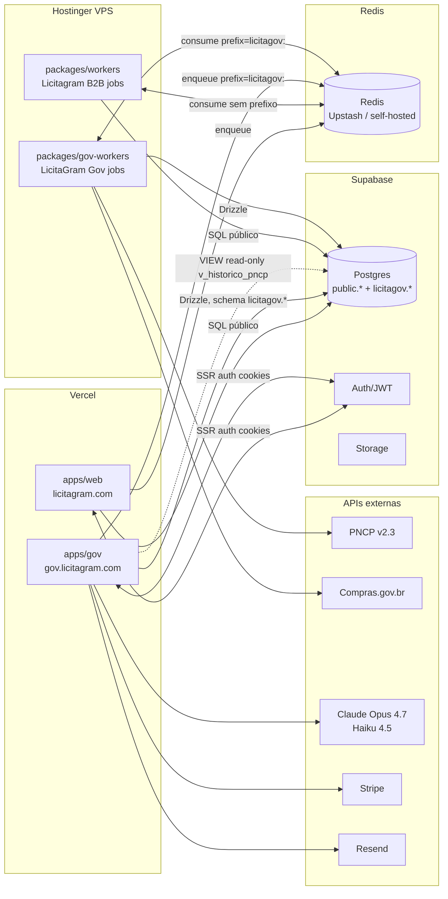
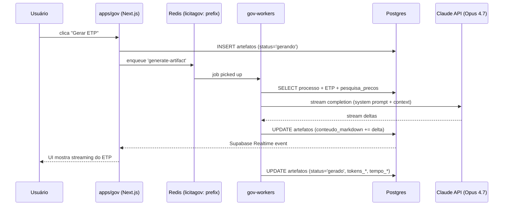

# LicitaGram — Arquitetura (Fase 0)

Este documento reflete o estado do monorepo após Fase 0 do master plan do LicitaGram Gov. Atualize a cada fase concluída.

## Visão geral do monorepo

```
licitagram/
├── apps/
│   ├── web/                # Licitagram B2B (produção, intocável — RI-1)
│   └── gov/                # LicitaGram Gov (novo, Fase 0+)
├── packages/
│   ├── shared/             # tipos, utils, constantes (compartilhado)
│   ├── workers/            # BullMQ Licitagram B2B (produção — RI-2)
│   ├── supabase/           # migrations SQL (ambos produtos)
│   ├── price-history/      # features de preços B2B
│   ├── proposal-engine/    # gerador de propostas B2B
│   ├── gov-core/           # núcleo agêntico e Drizzle do Gov
│   └── gov-workers/        # BullMQ do Gov (prefixo licitagov:)
├── docs/
│   └── internal/
│       ├── architecture.md       (este arquivo)
│       ├── adr/                   decisões arquiteturais
│       └── runbooks/              operação em produção
└── .github/workflows/ci.yml       CI com gate RI-8
```

## Diagrama de serviços



## Isolamento dos produtos

| Recurso | Licitagram B2B | LicitaGram Gov |
|---|---|---|
| Frontend | `apps/web` (Vercel project 1, `licitagram.com`) | `apps/gov` (Vercel project 2, `gov.licitagram.com`) |
| Workers | `packages/workers` (Hostinger, sem prefixo Redis) | `packages/gov-workers` (Hostinger, prefixo `licitagov:`) |
| Schema Postgres | `public.*` | `licitagov.*` (SEM escrita em `public.*`, RI-4) |
| Tema Tailwind | laranja `hsl(18 95% 55%)` | azul `hsl(217 91% 60%)` |
| Billing | Stripe (conta única, produtos separados) | idem, produtos `gov_*` |
| Env vars | `apps/web/.env.*` | `apps/gov/.env.*` |

## Supabase — schema e VIEWs

```
public.*
 ├── companies, users, tenders, subscriptions, ...   (Licitagram B2B)
 └── (imutável para o novo código — RI-4)

licitagov.*                                              (Fase 0 migration)
 ├── orgaos, usuarios, setores                          núcleo de tenancy
 ├── campanhas_pca, respostas_setor, itens_pca          PCA Collector (Fase 3)
 ├── historico_compras, perfis_regulatorios             referências
 ├── processos, artefatos                               licitação em andamento
 ├── riscos_identificados                               Mapa/Matriz (Fase 5)
 ├── precos_pesquisa, precos_estimativa                 Cesta de preços (Fase 6)
 ├── publicacoes_pncp                                   rastreamento publicação
 ├── catalogo_normalizado                               CATMAT/CATSER + pgvector
 ├── audit_log                                          trigger em todas tabelas (RI-9)
 └── v_historico_pncp                                   VIEW read-only sobre public.tenders
```

Todas tabelas têm RLS habilitado; policies básicas (filtro por `orgao_id` do usuário logado) foram criadas na migration inicial e serão refinadas nas fases seguintes.

## Fluxo de geração de artefato (exemplo: ETP, Fase 4)



## Observability

- **Sentry** (`@sentry/nextjs`): errors frontend + backend, source maps, release tracking. DSN em `SENTRY_DSN`. Init em `apps/gov/instrumentation.ts`.
- **Pino** (`pino`): logs estruturados JSON, redação automática de PII (`cpf`, `cnpj`, `email`, `senha`). RI-14 compliance.
- **PostHog** (`posthog-js`): funnels de onboarding, session recording com `maskAllInputs: true`. Init em `apps/gov/lib/analytics.ts`.
- **Vercel Analytics**: Core Web Vitals via plataforma.

## CI/CD

`.github/workflows/ci.yml` roda em PRs e pushes:

- `quality` — lint + type-check gov-core/gov-workers/gov.
- `test-gov` — Vitest para gov-core e gov-workers.
- `build-gov` — `next build` do app gov.
- `protect-licitagram-web` — **gate RI-8**: ativado apenas quando o PR mexe em `apps/web`, `packages/workers`, `packages/shared` ou migrations antigas. Bloqueia merge se `pnpm --filter web build` falhar.
- `ri6-queue-prefix` — **gate RI-6**: grep em `packages/gov-workers/src` para garantir que nenhuma `new Queue(` ou `new Worker(` escape do wrapper `createGovQueue/createGovWorker` (prefixo `licitagov:`).

## Arquivos críticos

| Arquivo | Propósito |
|---|---|
| [`packages/supabase/migrations/20260418000000_gov_schema_init.sql`](../../packages/supabase/migrations/20260418000000_gov_schema_init.sql) | Schema `licitagov.*` completo, VIEW histórico, audit trigger, RLS baseline |
| [`packages/gov-core/src/db/schema/index.ts`](../../packages/gov-core/src/db/schema/index.ts) | Drizzle schemas (orgaos/usuarios/setores na Fase 0; restante virá nas fases seguintes) |
| [`packages/gov-core/src/ai/claude.ts`](../../packages/gov-core/src/ai/claude.ts) | Wrapper SDK Anthropic; `CLAUDE_MODELS` constante com IDs Opus/Haiku |
| [`packages/gov-workers/src/queues.ts`](../../packages/gov-workers/src/queues.ts) | `createGovQueue`/`createGovWorker` com prefixo `licitagov:` (RI-6) |
| [`apps/gov/middleware.ts`](../../apps/gov/middleware.ts) | Supabase session refresh (Fase 0 stub; gates de plano vêm na Fase 1) |
| [`.github/workflows/ci.yml`](../../.github/workflows/ci.yml) | CI com gates RI-6 e RI-8 |
